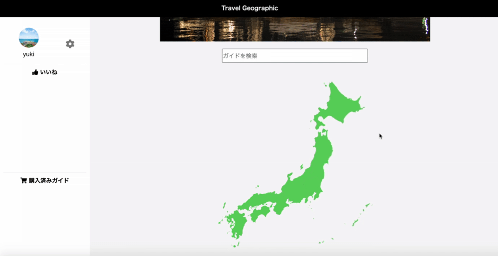

<h2 align="center">Travel Geographic</h2>

# 概要
**日本の美しい自然景観や文化景観の「なぜ？」を紐解き、旅先が好きになる・誇りに思えるデジタルガイドサービス**です。ユーザーは、気になるガイドを検索し、購入することができます。

# 本番環境
## 🌐 デプロイ先(S3との連携を行っておらず、画像は表示されません)
https://travelgeographic.herokuapp.com/

## :memo:テストアカウント
**Email**: taro75@gmail.com  
**Password**: NYN0rsnD

# 制作期間
10日間

# 制作背景(意図)
**現在の文化歴史観光の課題は、旅先の土地に関する情報を得にくい**ことです。そのように思ったきっかけは、私が学生時代に旅をしていたときに、いざ旅先の歴史や文化を知ろうと思っても、案内板が難しい、もしくはそもそもなくて、結局インスタ映えする写真だけ撮って帰ってしまったという経験です。歴史は、音楽やスポーツと同じように勇気や感動を与えてくれるものであるのに、それが十分に人々に伝わっていないと感じました。そこで、地理学者や歴史学者のヒアリングを元に、旅先の文化歴史の成り立ちを届けることで、旅先のことがさらに好きになり、そこで生きた人々の想いが人生を前向きにする新たな道標となってくれるのではないかと考えました。

# DEMO

### 1. トップページからログイン

### 2. ガイドを探す
#### 2-1. インクリメンタルサーチ

#### 2-2. 日本地図

### 3. お気に入り登録または購入

### 4. レビュー

# 工夫したポイント
- svgファイル・アンカーを導入し、日本地図上のエリアから検索できるようにすることで、旅先の名前がわからなくてもガイドを探しやすくしました。
- お気に入り登録機能を追加したことで、時間を空けてログインした時であっても、再度探す手間を省くことができます。
- ガイドを購入したことがわかるように、決済終了時に該当ガイドをサイドバーの「購入済みガイド」に表示させました。
- 画像を多く使用した事やslickを活用したスライドショーを採用した事で、ユーザーにとって見やすいUIを心がけました。
- 機能を絞る事で、老若男女誰もが使いやすいように設計しました。

# 使用技術(開発環境)
Ruby/Ruby on Rails/MySQL/Github/heroku/Visual Studio Code

# 課題や今後実装したい機能
<dl>
  <dt>本番環境で画像が表示されない</dt>
  <dd>S3のストレージと連携させることで、heroku特有のデータベースリセットを回避する</dd>
  <dt>ログイン方法を増やす</dt>
  <dd>APIを用いて、手軽なSNSログインを実装することで、ユーザーの利用率をあげる</dd>
  <dt>ガイドの内容を充実させる</dt>
  <dd>実際に地理学者や歴史学者のヒアリングを通じて、意義のあるガイドを作成したい</dd>
  <dt>リファクタリング</dt>
  <dd>変数やmixinを使用し、コードの可読性を上げていきたい</dd>
  <dt>コメントの編集・削除を可能にする</dt>
  <dd>ユーザーが、間違えて投稿したコメントを編集・削除する事で、サービスの使いやすさを上げていきたい。</dd>
  <dt>スマートフォンでも使用できるようにする</dt>
  <dd>Swiftを勉強し、旅行者がさらに気軽に土地の歴史や文化を知ることができるようにする</dd>
</dl>
  

# DB設計
## usersテーブル
|Column|Type|Options|
|------|----|-------|
|name|string|null: false|
|image|string|null: false|
|email|string|null: false|
|password|string|null: false|

### Association
- has_many :likes
- has_many :comments
- has_many :guides, through: :user_guides
- has_many :user_guides

## guidesテーブル
|Column|Type|Options|
|------|----|-------|
|title|string|-------|
|image|string|-------|
|body|text|-------|
|price|integer|-------|
|area|string|-------|

### Association
- has_many :users, through: :user_guides
- has_many :user_guides
- has_many :comments
- has_many :likes
- has_many :pictures

## picturesテーブル
|Column|Type|Options|
|------|----|-------|
|picture|string|-------|
|guide|reference|null: false, foreign_key: true|

### Association
- belongs_to :guide

## commentsテーブル
|Column|Type|Options|
|------|----|-------|
|text|text|null: false|
|user_id|integer|null: false, foreign_key: true|
|guide_id|integer|null: false, foreign_key: true|
### Association
- belongs_to :guide
- belongs_to :user

## user_guidesテーブル
|Column|Type|Options|
|------|----|-------|
|user|reference|foreign_key: true|
|guide|reference|foreign_key: true|
### Association
- belongs_to :guide
- belongs_to :user

## likesテーブル
|Column|Type|Options|
|------|----|-------|
|user_id|integer|null: false, foreign_key: true|
|guide_id|integer|null: false, foreign_key: true|
### Association
- belongs_to :guide
- belongs_to :user
